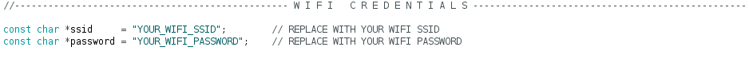

# Sunrise Alarm Clock V2

## Table of Contents

* [Introduction](#introduction)
* [Brief](#brief)
* [Method of Operation](#method-of-operation)
  + [Setup](#setup)
  + [Main Screen](#main-screen)
  + [Menu Layout](#menu-layout)
* [Circuitry](#circuitry)
  + [Schematic](#schematic)
  + [PCB Design](#pcb-design)
* [Enclosure](#enclosure)
  + [CAD Enclosure](#cad-enclosure)
  + [3D Printed Enclosure](#3d-printed-enclosure)
* [Demonstration](#demonstration)
* [Further Work](#further-work)

## Introduction

In my first year of university, I made a sunrise alarm clock for an assignment. Version 1 was a simple project using an Arduino Mega and an LCD keypad shield. [Here](https://github.com/SeanP2001/Arduino_Sunrise_Alarm_Clock) is a link to the repo for the original project. Over the past year and a half, I have developed my skills, so I decided to revisit this project.

## Brief

I wanted to design an alarm clock that uses light to wake me up naturally, making me feel more rested. However, I also needed an audio alarm to prevent me from solely relying on waking up naturally. Another feature I wanted to add was USB ports that could be switched on at time X and off at time Y. This would allow me to control USB-powered peripherals like lights, fans or a radio. I could also use these ports to charge devices without leaving them on charge all night.

## Method of Operation

### Setup

Before programming the alarm, you must put your Wi-Fi credentials in the "Sunrise_Alarm_Clock_V2.ino" file.

<p align="center">
  
</p>

When the alarm is first powered on, it will connect to your Wi-Fi to get the current date and time. It will then load any settings from EEPROM before it advances to the main screen (shown below).

### Main Screen

The alarm displays the day of the week and the current time on the main screen. There are also three icons. Unfortunately, the icons do not show up well in photos.

<p align="center">
  
</p>

Pressing the left button will toggle the light bar on and off. When the light bar is on, the icon on the left (light bulb) changes to show it is on. When it is on, the bulb is shaded in, and when it is off, the icon is just an outline of a bulb. The light is a useful feature to help you see when you are getting into bed in the dark.

Pressing the middle button enables and disables the audio alarm. Pressing this button will cause the central icon (a bell) to change from being shaded in when the buzzer is enabled to an outline when it is disabled. If the alarm sounds, pressing the middle button will turn it off.

Pressing the right button enters the menu (shown below).

<p align="center">
  
</p>

### Menu Layout

The menu has the following layout:

```
Main Menu
├── Alarm
│   ├── Light Bar
│   │   ├── On Time
│   │   └── Off Time
│   └── Buzzer
│       ├── On Time
│       └── Off Time
├── USB Ports
│   ├── USB 1
│   │   ├── On Time
│   │   └── Off Time
│   ├── USB 2
│   │   ├── On Time
│   │   └── Off Time
│   └── USB 3
│       ├── On Time
│       └── Off Time
├── Time
│   ├── Time Offset (hrs)
│   ├── Hours Between Syncs
│   └── Sync Time Now
└── Save
```

The "Alarm" settings allow you to alter when the light bar and buzzer automatically turn on and off. The "USB Ports" settings adjust when each port turns on and off.

In the "Time" menu, the "Time Offset" option allows you to set how many hours your time zone is ahead or behind UTC. The "Hours Between Syncs" option allows you to set how many hours the clock will run before it syncs to the time server again. "Sync Time Now" causes the alarm to reconnect to the Wi-Fi and connect to the time server to get the current time. This option is helpful if you have just altered the time offset and want to update the clock.

The "Save" option saves all of the settings to the EEPROM. This means you will not lose your settings when you turn the alarm off and back on again.

## Circuitry

### Schematic

<p align="center">
  
</p>

### PCB Design

|  |  |
| -------------------------------------------------- | ------------------------------------------------------- |
|                |                      |

## Enclosure

### CAD Enclosure

|  |  |
| ---------------------------------------------------------------------- | ------------------------------------------------------------ |

### 3D Printed Enclosure

<p align="center">
  
</p>

|  |  |  |
| ------------------------------------- | ------------------------------------------ | -------------------------------------- |

## Demonstration

[](https://www.youtube.com/watch?v=e8I5AvzANuw "Demo Video")

## Further Work

In future, I could;

- Create other wireless modules with which the alarm can communicate (windowsill light sensor, curtain motor, lamp).
- Add a weather icon to the main screen.
- Change the design to a more traditional alarm clock shape.
- Add a puzzle to switch off the alarm. This would prevent you from just hitting snooze.
